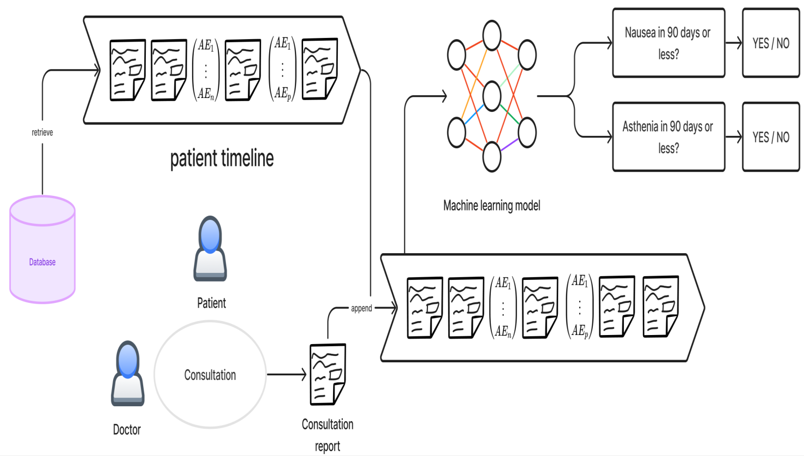

# Evaluation des performances 

Dans ce repo, on retrouve le modèle qui a permis l'apprentissage et l'évaluation des perfromances. Ce dernier est reproductible et en voici la description ainsi que son utilisation.

## Sommaire

1. [Description du modèle](#1-modèle--prédiction-des-événements-indésirables-graves-sae)
2. [Fine-tunage du modèle](#2-fine-tunage-du-modèle)
3. [Perspectives](#3-perspectives)

## 1. Modèle : Prédiction des Événements Indésirables Graves (SAE)

Pour répondre à notre problématique, j'ai repris le travail initié par un ancien collègue du CLB, Raphaël Vienne, en utilisant un modèle d'apprentissage automatique qu'il a développé. SAE correspond donc à Serious Adverse Events et ce modèle permet de prédire certaines maladies pouvant conduire ou être associées à une hospitalisation dans les 90 jours, en se basant sur les textes des rapports de consultation. Ci-dessous un exemple de prédiction (Nausée ou Asthénie) à partir de la timeline d'un patient. 

## 2. Fine-tunage du modèle

Afin de ré-entraîner le modèle, il faut relancer le Trainer dans [*sae_trainer.py*](./sae_trainer.py).

A ce jour, j'ai réalisé 2 nouveaux entraînements dans un contexte de classification multi-label. Ces derniers sont contenus dans *modeles/*. Le premier modèle est fine-tuné sur des données brutes (non transformées), et le deuxième modèle sur les données smilisées. 

Les labels choisis pour ce fine-tunage sont : 
- R11 (Code PMSI pour Nausée et Vomissement)
- R53 (Code PMSI pour Malaise et Fatigue)

Voici les résulats obtenus sur les données de test pour le modèle entraîné sur les **données brutes** :

Voici les résulats obtenus sur les données de test pour le modèle entraîné sur les **données smilisées** :

## 3. Perspectives

A la fin de mon stage, nous nous sommes accordées sur deux grands axes à observer :

1. Observer les courbes d'apprentissage. 

En effet, je n'ai pas réussi à mettre en place dans le code la possibilité d'observer la training loss et validation loss au cours de l'apprentissage. Cela provient probablement de fonction qui me causait des erreurs dans la fonction *_inner_training_loop* de *sae_trainer.py*. Les erreurs proviennent de :
- *_maybe_log_save_evaluate*, ligne 633 et 651
- *log(metrics)*, ligne 696
- *callback_handler.on_train_end*, ligne 708.

2. Observer les hyper-papramètres.

Pour mon entraînement j'ai récupérer les hyper-paramètres utilisé par Raphael dans l'élaboration de son meilleur modèle (disponible sur la VM dans). Cela 