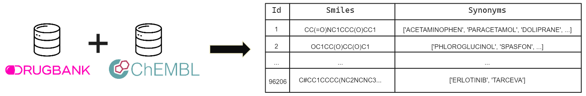

# Intégration des formules SMILES dans les comptes-rendus de consultation des patients

Ce repo explorera deux aspects essentiels de ce processus : d'une
part, la **détection des médicaments** au sein des documents médicaux, et d'autre part, le **remplacement des médicaments** identifiés par leurs représentations SMILES, afin de standardiser et enrichir les données médicales pour une meilleure exploitation.

## Sommaire

1. [Qu'est ce qu'une formule SMILES ?](#1-quest-ce-quune-formule-smiles-)
2. [Méthodes employées](#2-méthodes)
    - a. [Détection des médicaments](#a-détection-des-médicaments)
    - b. [Intégration des SMILES](#b-intégration-des-smiles)
3. [Application](#3-application)
    - a. [Création du dictionnaire](#a-création-du-dictionnaire)
    - b. [Intégration des SMILES](#b-intégration-des-formules-smiles) 

## 1. Qu'est ce qu'une formule SMILES ?

SMILES signifie **S**implified **M**olecular **I**nput **L**ine **E**ntry **S**ystem. La formule SMILES est une notation de lignes de structure chimique (une méthode typographique utilisant des caractères imprimables) pour saisir et représenter les molécules. En plus des propriétés de bases qu’on pourrait retrouver dans une formule développée, la formule SMILES présente l’intérêt de
posséder aussi d’autres propriétés comme la chiralité des atomes l'aromaticité, la stéréochimie, ou encore les différents isotopes. L’image ci-dessous est un exemple de formule SMILES représentant
l’aspirine : 

## 2. Méthodes

### a. Détection des médicaments

Afin de détecter les médicaments, j'ai utilisé l'outil **EDS-NLP** provenant de Spacy. Cet outil est un framework collaboratif de NLP qui vise à extraire des informations à partir de notes cliniques en français. Au cœur du système, il s'agit d'une collection de composants ou de pipelines, qui sont soit des fonctions basées sur des règles, soit des modules d'apprentissage profond.

### b. Intégration des SMILES
Une fois les médicaments détectés dans les comptes-rendus médicaux, l'étape suivante consistait à les remplacer par leur formule SMILES. Pour accomplir cette tâche, j'ai développé une approche en deux volets : 
- d'une part, la création d'une base de données complète des formules SMILES correspondant aux médicaments détectés,
- d'autre part, la mise en place d'un algorithme efficace pour associer chaque médicament à sa formule SMILES.

Après avoir analysé les performances des différentes bases de données, j'ai constaté que la combinaison de **ChEMBL** (base de données bioinformatique qui contient des informations sur
les bioactivités des molécules à petite échelle) et **DrugBank** (base de données bioinformatique contenant des informations détaillées sur les médicaments et les composés chimiques qui sont approuvés pour l'usage clinique) offrait les résultats les plus efficaces pour le remplacement des médicaments par leurs formules SMILES. J'ai donc crée un "dictionnaire de SMILES" que j'associe à tous les médicaments et alias possible d'un composé chimique. Le schéma ci-dessous représente la forme de ce ditionnaire :  

## 3. Application

### a. Création du dictionnaire
Afin de créer le dictionniare j'ai mis en place 3 scripts : 

- *create_chembl_dico* : créée le dictionnaire de ChemBL à partir de sa base de donnée *chemb_34_sqlite.tar.gz* récupérer [ici](https://ftp.ebi.ac.uk/pub/databases/chembl/ChEMBLdb/latest/)
- *create_durgabnk_dico* : créée le dictionnaire de Drugbank à partir de sa base de donnée stockée dans *drugbank2024.xml* récupérer [ici](https://go.drugbank.com/releases/latest?_gl=1*yklr9l*_up*MQ..*_ga*MzQ1MzM2NDIzLjE3MjY0OTUyODE.*_ga_DDLJ7EEV9M*MTcyNjQ5NTI3OC4xLjAuMTcyNjQ5NTI3OC4wLjAuMA..#full)
- *create_final_dico* : créée le dictionnaire de final en fusionnant les deux dictionnaires précédents

### b. Intégration des formules SMILES
J'ai mis en place un script qui permet de **détecter les médicaments** dans un premier temps. Dans un second temps, le code **remplace ces médicaments** en leur formule SMILES au sein même du compte-rendu médical. Pour cela il faut exécuter *smiles_integration_app.py* qui lui va traiter un objet de type Dataset.

